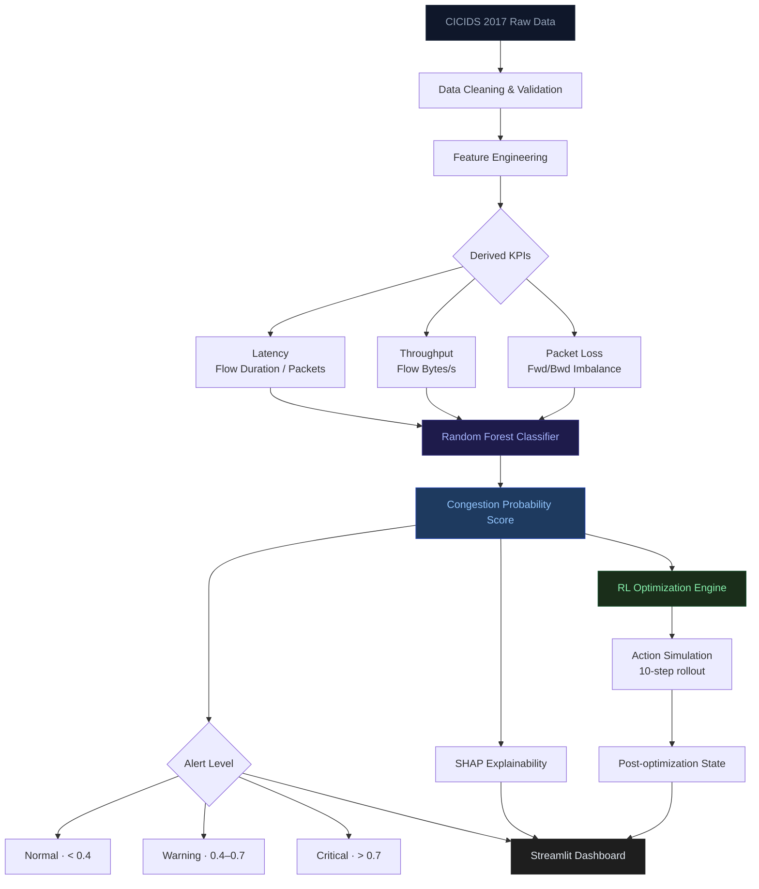
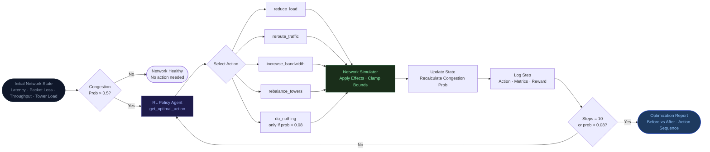
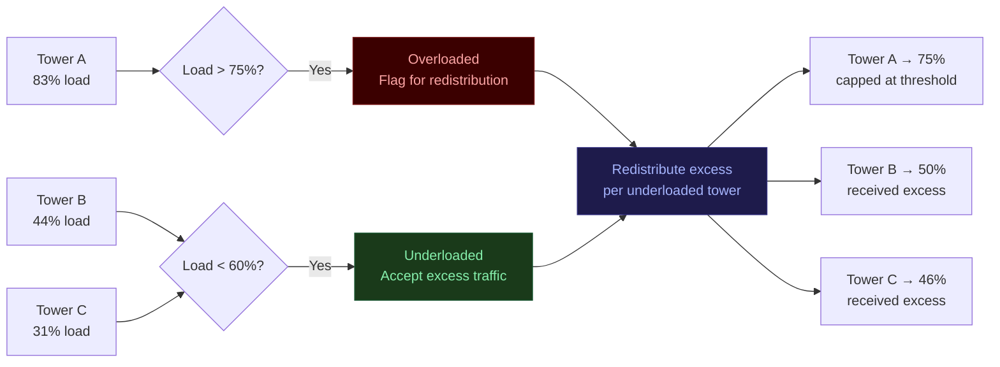
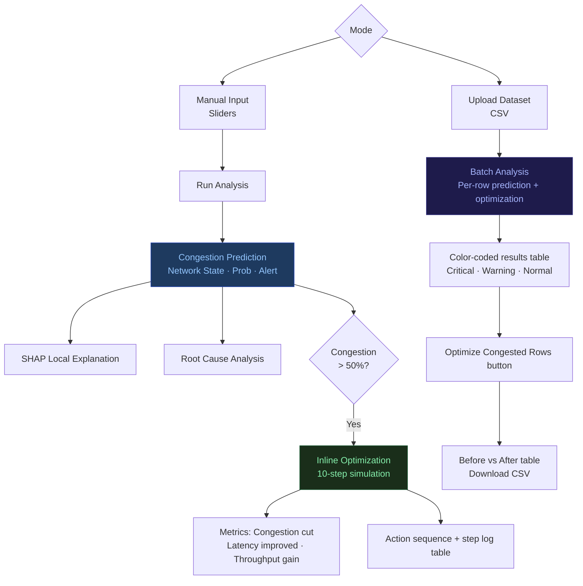

# Network Performance Optimization
### AI-Powered Telecom Congestion Intelligence Platform

<div align="center">


*Proactive congestion detection, RL-based optimization, and explainable AI — on real CICIDS 2017 network data.*

</div>

---

## Overview

Traditional telecom monitoring is reactive — it alerts after performance has already degraded. This platform is designed to be **proactive**: it predicts congestion before it becomes critical, explains the root cause, and runs an AI optimization agent to simulate corrective actions.

The system combines a **Random Forest classifier** for congestion prediction with a **rule-based RL optimization engine** that simulates sequential network actions (rerouting, load balancing, bandwidth scaling) and measures how much each action reduces congestion probability.

---

## Architecture



---

## Optimization Pipeline



---

## Key Capabilities

| Capability | Description |
|---|---|
| **Congestion Prediction** | Random Forest with probability scoring, threshold tuning, and safety override rules |
| **Explainability** | SHAP local explanations showing which features drove each prediction |
| **RL Optimization** | 10-step sequential simulation with priority-based action selection |
| **Tower Optimization** | Detects overloaded towers (> 75%), redistributes load to underloaded nodes (< 60%) |
| **Batch Analysis** | Upload a CSV, get prediction + optimization results per row, download report |
| **Alert System** | Three-tier alert: Normal / Warning / Critical with color-coded banners |
| **Root Cause Analysis** | Data-driven diagnosis: high packet loss, routing delay, bandwidth bottleneck |

---

## Dataset

**CICIDS 2017** — Canadian Institute for Cybersecurity Intrusion Detection dataset. Contains real-world network traffic flows with labeled attack and benign traffic.

Since telecom KPIs are not directly available in the raw dataset, all features are derived:

| KPI | Derivation |
|---|---|
| Latency | `Flow Duration / Total Packets` |
| Throughput | `Flow Bytes/s` (raw feature) |
| Packet Loss | Forward/backward packet imbalance ratio |

---

## Model

**Random Forest Classifier** — chosen for its ability to capture nonlinear interactions between latency, throughput, and packet loss without requiring a linear decision boundary. Tree ensembles handle noisy telecom data well and support SHAP-based explainability natively.

### Training Configuration

```
Train/test split : 80/20 stratified
Training seed    : fixed for reproducibility
Evaluation seed  : random_state=99 (separate from training)
Threshold tuning : probability-based, not hard 0.5 cutoff
Safety overrides : rule-based upgrades for extreme packet loss / latency
```

### Performance

| Metric | Score |
|---|---|
| Accuracy | **97.11%** |
| Precision | **91.02%** |
| Recall | **95.77%** |
| F1 Score | **95.77%** |

> Evaluation is performed on unseen test data only. No data leakage. Metrics balance congestion recall (avoiding missed critical states) with precision (avoiding false alarms).

---

## RL Optimization Engine

The optimizer simulates a 10-step network recovery using a **priority-based policy agent**:

### Action Space

| Action | Primary Effect |
|---|---|
| `reduce_load` | Cuts packet loss 50–70%, slight latency improvement |
| `reroute_traffic` | Reduces latency 25–40%, slight throughput gain |
| `increase_bandwidth` | Boosts throughput 30–50% |
| `rebalance_towers` | Redistributes tower load to underloaded nodes |
| `do_nothing` | Only fires when congestion probability < 0.08 |

### Policy Logic

```
if congestion_prob < 0.08     → do_nothing
elif packet_loss > 0.25       → reduce_load
elif latency > 2500           → reroute_traffic
elif throughput < 300 Mbps    → increase_bandwidth
elif tower_load > 75%         → rebalance_towers
else                          → reroute_traffic
```

Actions rotate to avoid repeating the same action more than twice consecutively.

### Reward Function

```
+50 × (old_congestion_prob − new_congestion_prob)   ← primary signal
+2.0 if latency improved
+1.0 if throughput improved
−2.0 if state got worse
+10.0 if do_nothing correctly (prob < 0.08)
−3.0 if do_nothing incorrectly (prob > 0.08)
```

### Typical Result

Starting from a Critical state (congestion ≈ 0.99):

```
Step 0  baseline        Cong: 0.990  PktLoss: 1.000  Latency: 4750
Step 1  reduce_load     Cong: 0.640  PktLoss: 0.611  Latency: 4068
Step 2  reduce_load     Cong: 0.412  PktLoss: 0.383  Latency: 3766
Step 3  reroute_traffic Cong: 0.285  PktLoss: 0.383  Latency: 2250
Step 4  increase_bw     Cong: 0.164  PktLoss: 0.265  Latency: 2100
Step 5  reduce_load     Cong: 0.071  PktLoss: 0.128  Latency: 1800
Step 6+ do_nothing      Cong: 0.071  ← healthy, agent idles
```

**Congestion reduced: ~89% · Latency improved: ~40% · Throughput gain: ~100%**

---

## Tower Optimization



- Overload threshold: **75%**
- Redistribution targets: towers with load **< 60%**
- Metrics shown: overloaded before/after, load variance reduction

---

## Dashboard

Five-tab Streamlit interface:

```
Overview          — KPIs, model performance, dataset summary
Network Analytics — Correlation heatmap, latency/throughput distributions
Time Intelligence — Trend lines, congestion spike detection
Tower Optimization — Load redistribution charts, before/after comparison
Prediction & Control — Manual input + batch CSV upload, inline optimization
```

### Prediction & Control Tab Flow



---

## Input Scale Reference

| Slider | Scale | Notes |
|---|---|---|
| Latency | 0 – 5000 | Model scale (derived from raw flow duration) |
| Packet Loss | 0.0 – 1.0 | Ratio (0.01 = 1% loss) |
| Throughput | 0.0 – 1.0 | Normalized traffic pressure (×1000 for optimizer) |
| Tower Load | 0 – 100 | Percent |

---

## Project Structure

```
.
├── dashboard/
│   └── app.py                  — Streamlit UI (all tabs)
├── optimizer/
│   ├── network_simulator.py    — TelecomNetworkEnv (gym-style)
│   ├── rl_agent.py             — Priority-based policy agent
│   ├── simulation_runner.py    — 10-step rollout + step logging
│   ├── analytics.py            — Strategy comparison, trajectory charts
│   └── report_generator.py     — Markdown optimization report
├── src/
│   ├── data_loader.py
│   ├── features.py
│   ├── train.py
│   └── predict.py
├── models/
│   └── network_model.pkl       — Trained Random Forest
├── data/
│   └── raw/                    — CICIDS 2017 (git-ignored)
├── tests/
└── README.md
```

---

## Quick Start

```bash
git clone https://github.com/shivam-rane/AI-Network-Congestion-Optimizer.git
cd AI-Network-Congestion-Optimizer

pip install -r requirements.txt

streamlit run dashboard/app.py
```

### Requirements

```
streamlit
scikit-learn
pandas
numpy
matplotlib
shap
gymnasium
```

---

## Limitations

- Packet loss is approximated from forward/backward packet imbalance — not directly measured
- Dataset is static (CICIDS 2017); no real-time streaming
- RL agent uses a rule-based policy, not a trained neural network
- Optimization simulator uses fixed action effect ranges (stochastic but bounded)

---

## Roadmap

- [ ] Real-time data ingestion via Kafka
- [ ] LSTM-based time series congestion forecasting
- [ ] Trained DQN agent replacing rule-based policy
- [ ] Cloud deployment (AWS / GCP)
- [ ] Multi-tower network graph visualization

---

## Author

**Shivam Rane**  
[github.com/shivam-rane](https://github.com/shivam-rane)

---

<div align="center">
<sub>Built with CICIDS 2017 data · Random Forest · SHAP · Streamlit · Rule-based RL</sub>
</div>